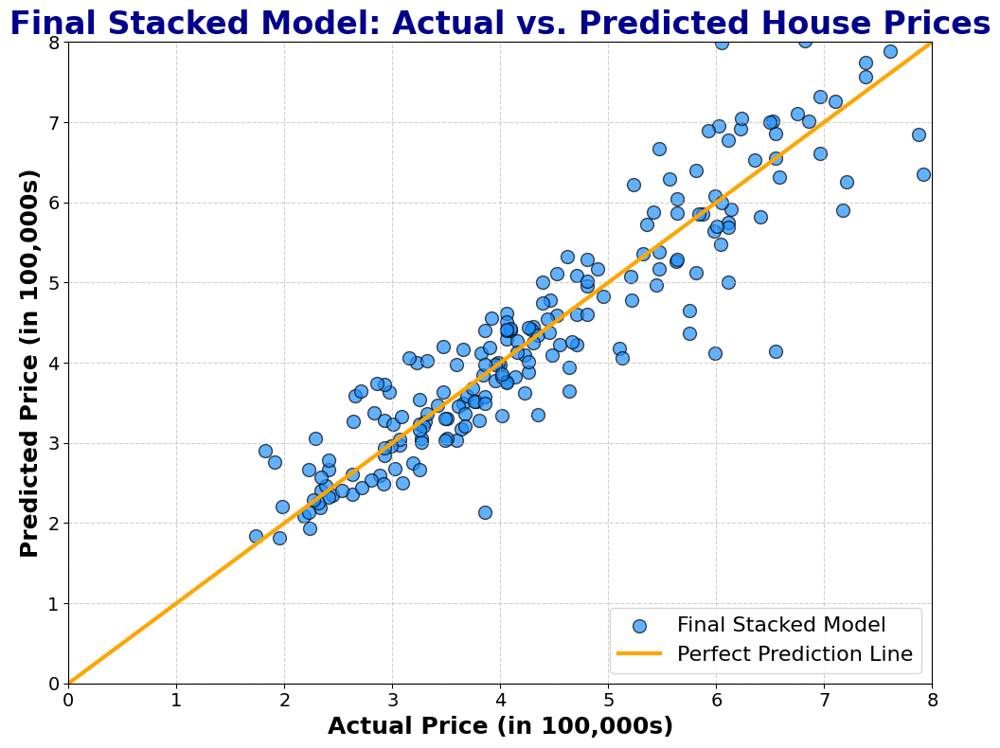

# Real Estate Price Prediction with Stacked Ensemble Model

This repository contains a comprehensive analysis and machine learning project aimed at predicting real estate prices using a custom stacked ensemble regression model. The project includes rigorous Exploratory Data Analysis, advanced visualizations, individual models, and a custom stacking logic designed to optimize prediction accuracy.

## Model Performance
### Individual Models

### Stacked Models

## Repository Contents

- **`Real Estate Stack.py`**: It includes:
  - Rigorous Exploratory Data Analysis with detailed and advanced visualizations
  - Feature Engineering and Data Preprocessing based on MI scores and visualizations from EDA.
  - Model training using five different algorithms:
    - **Random Forest Regressor**
    - **XGBoost Regressor**
    - **LightGBM Regressor**
    - **CatBoost Regressor**
    - **Artificial Neural Network**

  - **Custom stacked ensemble model** that combines the predictions from the above models for improved performance, with a focus on reducing both bias and variance.
  - **Customized Optuna study** for each model's Bayesian optimization objective, tailored to maximize the model's performance.
  - Evaluation metrics including **Adjusted R²** and **RMSLE**, with detailed analysis of model performance.

- **`train.csv`**: The training dataset contains various features of the properties along with the target variable `SalePrice`.

- **`test.csv`**: The test dataset without the target variable `SalePrice`. This is used for final predictions using the trained model.

- **`requirements.txt`**: A file listing all the Python libraries and dependencies required to run the Jupyter Notebook. 

## Highlights

### Custom Stacked Ensemble Model
- **Five Base Models**: 
  - Random Forest Regressor
  - XGBoost Regressor
  - LightGBM Regressor
  - CatBoost Regressor
  - Artificial Neural Network (with TensorFlow)
  
- **Custom Stacking Logic**: Implemented a custom stacking mechanism to combine the predictions from the above models. This approach helps to reduce the model's bias and variance, leading to better generalization of unseen data.
- **Customized Loss Function for ANN**: Designed a unique loss function for the ANN to enhance performance on real estate data, effectively handling outliers and skewed distributions.
- **Customized Scoring Function for Optuna Study**: Created a custom scoring function in Optuna to optimize model hyperparameters, balancing key metrics like RMSE and RMSLE.

### Bayesian Optimization with Optuna
- Each model’s hyperparameters were fine-tuned using a **customized Optuna study** with a Bayesian optimization objective tailored to each model’s specific characteristics. This ensures that the models are optimized for the best performance.

### Performance Metrics
- **MSE**
- **RMSE**
- **RMSLE**
- **R² score** and **Adjusted R² score**

- **Model Performance**: Evaluated using various metrics such as **RMSLE**, RMSE, and R² score. Detailed results, including visualizations and comparisons of different models, are provided in the notebook.
- **Final Accuracy**: The final stacked model achieved an RSMLE as low as 0.11 and, an R² score and an Adjusted R² both around 0.93 with a difference of less than 0.002! This means my feature engineering is terrific.
